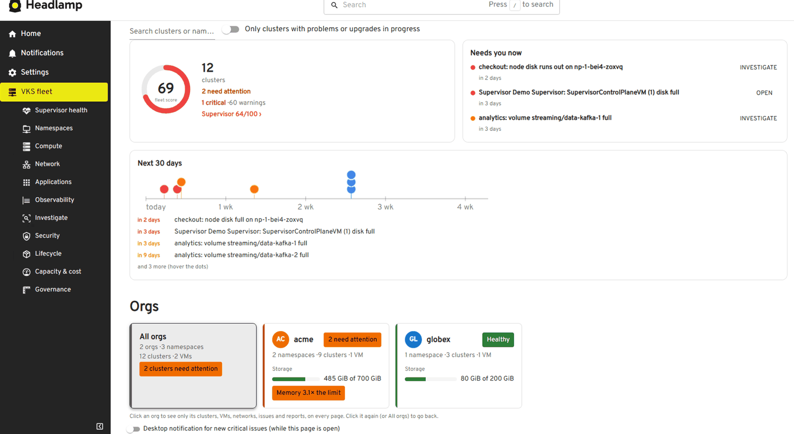
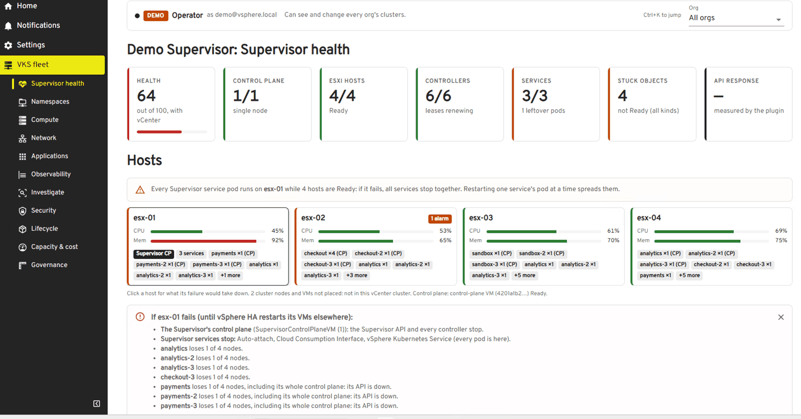
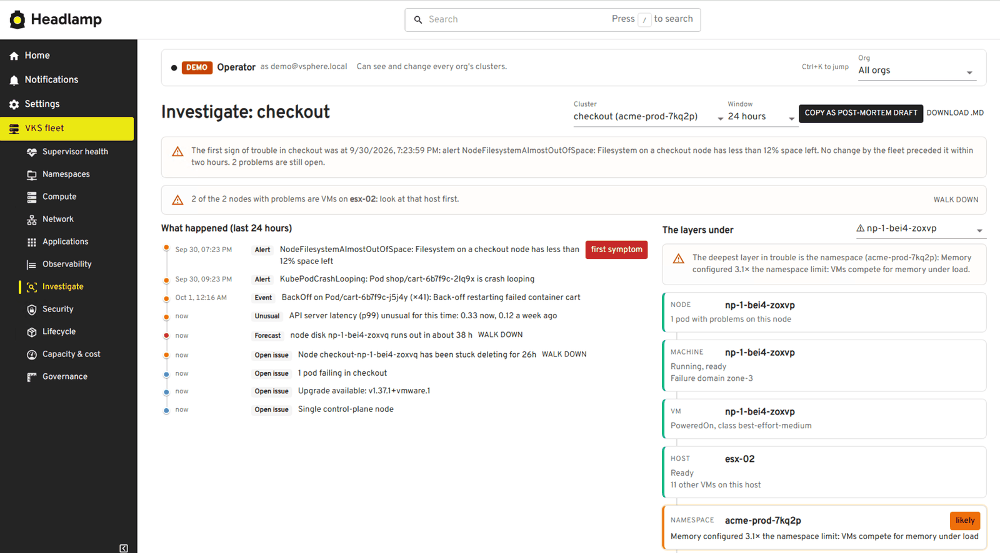
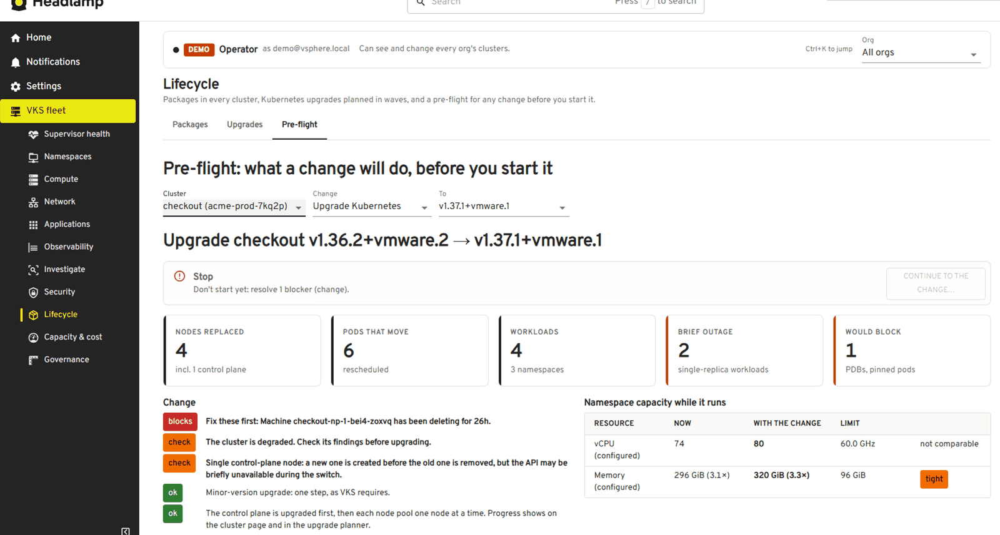

# VKS fleet

**One view of every vSphere Kubernetes Service (VKS) cluster across your Supervisors**: what needs you now, what runs out in the next 30 days, the Supervisor itself, and a pre-flight before every change. A [Headlamp](https://headlamp.dev) plugin.

> **A personal open-source project.** Not affiliated with, endorsed by, or supported by Broadcom or VMware. Product names are used only to describe what it works with (see [NOTICE](NOTICE)). [Apache 2.0](LICENSE).



**Try it in two minutes without a lab:** install the plugin, open *VKS fleet*, and choose **Try the demo**: a fictional fleet with realistic problems, where nothing is ever changed.

## What it does

Operating a fleet of VKS clusters means moving between the Supervisor, vCenter, each cluster's API and its Prometheus. vks-fleet reads all of them through their public APIs (Cluster API, VM Operator, NSX VPC, Carvel, Prometheus, and vCenter through a small collector) and follows the way an operator works:

**Observe.** The fleet page opens with a fleet score, **Needs you now** and **the next 30 days**, then one row per cluster with health, issues, best-practice score, baseline, backup, certificates, version and nodes. **Supervisor health** shows the platform itself: its controllers, services, control-plane VM and hosts, with vCenter's own view and 24 hours of utilisation. [Features](docs/features.md) · [The Supervisor](docs/supervisor.md)



**Detect.** Issues are ranked, time-bound problems first, each with its cause and what to do: stuck nodes, drains blocked by PodDisruptionBudgets, crash loops, certificates, quota and overcommit, controllers that stopped reconciling, services running on a single host, CIS-aligned compliance, vulnerabilities from Trivy, and drift from your own baseline profiles.

**Explain.** **Investigate** puts one cluster's timeline (changes, alerts, events, anomalies) beside a **walk down the layers** under a node: pod, node, Machine, VM, ESXi host, namespace, Supervisor, with the deepest unhealthy layer named. It drafts the post-mortem too. [Observability and investigation](docs/observability.md)



**Predict.** Prometheus forecasts (disks, memory, volumes), the Supervisor's control-plane disk, and certificate expiries land on a 30-day timeline. **Pre-flight** answers *what will this change do?* before an upgrade, a scale or a VM class change: capacity while it runs, the pods and workloads that move, what would block, and a verdict. [Making changes safely](docs/making-changes.md)



**Remediate.** Upgrades, scaling, node replacement, timeouts, packages, VMs and clusters, each from a dialog with its checks, a server-side dry run and a confirmation. With **read by default, elevate to change**, changes need a time-limited elevation with a reason.

**Audit.** Every change is stamped on what it changed and shows in the change audit and the activity heatmap. Compliance exports evidence (Markdown, CSV, OSCAL).

## Who it's for

The same plugin serves everyone; what each person sees and can do comes from their own RBAC, not a mode in the UI. **Operators** see every org, with fleet-wide actions. **Read-only admins** see everything and change nothing. **Tenants** (directly or through VCF Automation) see only their own org's namespaces and clusters.

## Quick start

- **Headlamp desktop app or Docker:** extract the release's `vks-fleet.tar.gz` into Headlamp's plugins folder, restart Headlamp, and open *VKS fleet*.
- **In a cluster, with Helm:** the chart attached to each release, with a job that keeps sign-ins fresh and the optional vCenter collector:

  ```bash
  helm install vks-fleet https://github.com/avnish80/vks-fleet/releases/latest/download/vks-fleet-<version>.tgz \
    -n vks-fleet --create-namespace --set plugin.source=download --set refresher.supervisors=<supervisor address>
  ```

  See [the chart](deploy/helm/vks-fleet/README.md) for the credentials Secret and exposure, or [deploy/](deploy/README.md) for kustomize.

Then connect a Supervisor (Settings → Plugins → vks-fleet). [Getting started](docs/getting-started.md) covers sign-ins, multiple Supervisors, tenants and what to verify first.

## Security in brief

The plugin runs in your browser with Headlamp's sign-ins: no server, no credentials and no telemetry of its own. It changes nothing unless you run an action, and every action shows its checks and runs a dry run first. The vCenter collector uses a read-only account. Details, and how to report a problem privately: [SECURITY.md](SECURITY.md).

## Compatibility

Developed and tested against VMware Cloud Foundation 9.1 with vSphere Kubernetes Service 3.7 (Cluster API v1beta1), on a recent Headlamp. Other versions may work; issues with version details are welcome.

## Documentation

- [Getting started](docs/getting-started.md): running it, sign-ins, multiple Supervisors, demo mode, what to verify first
- [Features](docs/features.md): every page and what it shows
- [The Supervisor](docs/supervisor.md): Supervisor health, hosts, the vCenter collector
- [Observability and investigation](docs/observability.md)
- [Making changes safely](docs/making-changes.md): pre-flight, elevation, actions, provisioning
- [Deployment](deploy/README.md) and the [Helm chart](deploy/helm/vks-fleet/README.md)
- [Development and reference](docs/development.md): building, tests, code layout, what it reads, known limits
- [Changelog](CHANGELOG.md) · [Contributing](CONTRIBUTING.md) · [Security](SECURITY.md)
