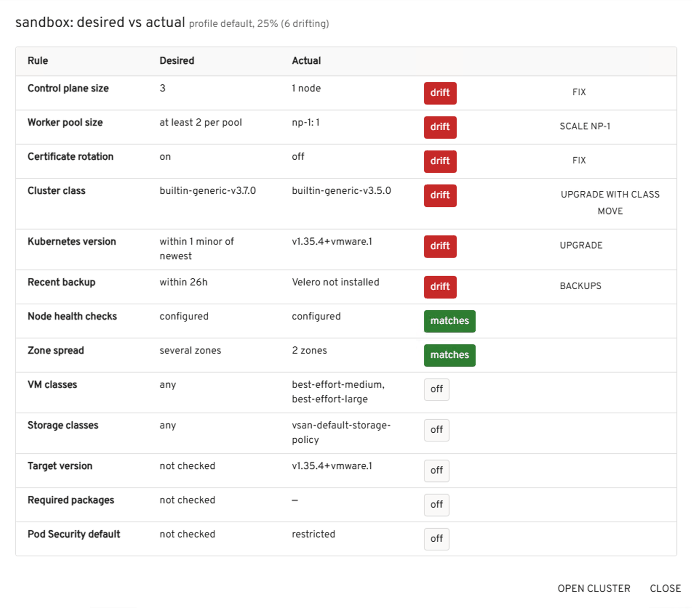

# Features

[← Back to the README](../README.md)

## The pages

The sidebar has eleven entries. Five are hubs with tabs, each keeping what used to be separate pages under one header; every old link still opens the right tab.

| Entry | What's in it |
|---|---|
| **VKS fleet** | The fleet page. **Dashboard:** fleet score and trend, needs you now, eight blocks, the cluster wall · **Clusters:** clusters at a glance, activity, org cards · **Issues:** simulate fixes, the next 30 days, issues |
| **Supervisor health** | The platform itself: controllers, services, placement, hosts, vCenter's view |
| **Namespaces** | Per-org namespaces, quotas, VMs, networks; New VM… and New cluster… |
| **Compute** | Nodes (machines) · VMs |
| **Network** | VPCs, subnets, load balancers, NSX objects |
| **Applications** | Apps across clusters, image drift, GitOps |
| **Observability** | Prometheus charts with change markers, forecasts, alerts, right-sizing, comparisons |
| **Investigate** | One cluster's timeline with a post-mortem draft, beside the walk-down through its layers |
| **Security** | Posture · Compliance · Vulnerabilities |
| **Lifecycle** | Packages · Upgrades · Pre-flight |
| **Capacity & cost** | Capacity · Showback |
| **Governance** | Baseline · Cleanup · Access |

Search is one keystroke away everywhere: **Ctrl+K**.

**The fleet page** has three tabs. Each has its own address (`?tab=clusters`, `?tab=issues`), so a link or the back button lands on the same one.

**Dashboard** is one screen that says how the fleet is, with every part opening the page that owns the detail:

- **The fleet score** (a ring with the average cluster score) beside the fleet in one sentence: how many clusters need attention, how the score moved since your last visit, and the check that costs it the most points. Click the score for **what holds the score down**: the best-practice checks that cost the most points across the fleet, largest first, each opening the clusters where it isn't passing.
- **The trend:** the score over the last 30 days. It is kept **in this browser only**, one point a day, for 90 days, per Supervisor filter and org: nothing is stored on a server, another browser (or another person on a shared Headlamp) starts its own history, and a new install shows *Trend starts today* until there is a second day. Demo mode comes with a made-up month.
- **Needs you now:** the three most urgent items, one line each, time-bound problems first (something running out within a week, a certificate within two), then critical issues, then warnings; each with Fix…, Investigate or Open, and a link to all the issues.
- **Eight blocks**, each one number, a status dot and one line of reason, with **its own trend**: a small line of that figure over the last 30 days and how it moved since your last visit (▲ or ▼ with the amount, green when that is the good direction and red when it isn't; the tooltip says it in words). The trends come from the same browser-only history as the score, so they appear from a block's second day. A block whose figure can change meaning (Capacity shows time left when something is filling up, otherwise the busiest node) keeps a separate trend for each, so a line never mixes two measures.

  | Block | Shows | Opens |
  |---|---|---|
  | Clusters | how many need attention, of how many | the Clusters tab |
  | Supervisor | its health score, and whether its controllers are renewing | Supervisor health |
  | Capacity | how long until something fills up; otherwise the busiest node | Capacity & cost |
  | Next 30 days | what expires or runs out, by kind | the timeline on the Issues tab |
  | Lifecycle | packages failing to reconcile, then upgrades, then version drift | Lifecycle |
  | Security | open posture, compliance and vulnerability findings | Security |
  | Governance | the match against your baseline, and clusters without a backup | Governance |
  | Network | the fullest subnet | Network |

  A red dot means something is failing or about to; amber is worth a look; green is fine; an empty dot means there is no judgement to make (or nothing to read yet). A block shows `—` when this account can't read what it needs.
- **The cluster wall:** one tile per cluster, grouped by org and coloured by its worst open issue, which it names; a tile opens its cluster. A filled tile **needs attention**: a critical issue, a warning about something failing or running out, or a cluster the Supervisor doesn't report healthy. A dashed outline is **advisory only**: nothing is failing, but posture or hygiene findings are open (a missing Pod Security level, an older version, a single control plane, scanner, policy and compliance findings). The sentence at the top, the Clusters block and the org cards count *needs attention* the same way.

**Clusters** has a filter box, *only clusters with problems*, **Export report**, and **Clusters at a glance**: one row per cluster, worst first, with health, issues, best-practice score, baseline, backup, certificates, version and nodes, each coloured. Below it: versions in use when there is more than one, the activity heatmap, and the org cards. Names are shortened when clusters share a prefix (`kubernetes-cluster-a1b2` shows as `a1b2`, nodes without their cluster's prefix), with the full name on hover.

**Issues** has what changed since you last looked, **Simulate**, **Do these first**, **the next 30 days** (a timeline and a list of what expires or runs out: control-plane certificates, disks and volumes filling up from Prometheus forecasts, the Supervisor's control-plane disk, and silences or waivers that end and bring their issue back), and the issues themselves, one line each until opened.

**Every open issue is in one of three states:**

- **Fix ready:** the plugin has a guarded action that reliably clears it (unblocking or replacing a stuck or powered-off node, resuming a paused cluster, clearing leftover timeouts, turning on certificate rotation, scaling a control plane to 3, setting a Pod Security level).
- **Recommended:** the plugin has a specific next step, but it is a planned change or its outcome isn't certain. The step is on the issue's button, with why on hover.
- **Needs a decision:** only you can judge it (RBAC grants, privileged workloads that belong to an app, vulnerabilities, quota, what vCenter reports). The plugin shows the evidence and a runbook.

**Do these first** lists the recommended steps for the whole fleet, the same step for many clusters as one line, with what it would clear, the score points it would bring back (only where a best-practice check measures it), and how much it takes: **one click** (an action with a dry run), **guided** (a few steps on a page) or a **change window** (a planned change). Urgent ones come first (a critical issue, or something running out), then by score points and issues cleared. **Why** shows the reasoning and the clusters. Nothing is changed from the list: each step opens the action, page or runbook where it is done.

| Recommended step | For | Takes |
|---|---|---|
| Upgrade Kubernetes | a version behind the newest release | Change window |
| Move to the current cluster class | an older class | Change window |
| Re-reconcile failing packages | a package that failed to reconcile | One click |
| Update packages | newer package versions available | Guided |
| Get backups running again | a failed or stale backup | Guided |
| Install Velero and schedule backups | no backup tool in the cluster | Guided |
| Set a default StorageClass | none set | Guided |
| Add a default-deny network policy | namespaces without a network policy | Guided |
| Replace the node | a node disk forecast to fill up | One click |
| Expand volumes | a volume forecast to fill up | Change window |
| Add node capacity | node memory forecast to run out, or a node above 90% | Change window |
| Clean up leftovers | objects left by deleted clusters and failed service pods | One click |
| Spread node pools across zones | one zone used where the Supervisor has several | Change window |
| Turn on automatic node repair | no machine health check allowed to act | Guided |

**Simulate** has three views: **As it is**; **With fixes**, the fleet after the fixes the plugin already has; and **With fixes and recommendations**, with the recommended steps done as well. The score is shown before and after, a wall shows each cluster as it would be, cleared issues and steps are marked, and what's left is what needs a decision. It only redraws the page; nothing is sent to any cluster. An upgrade and a class change are recommended but never counted in Simulate: each is a project with its own planning.

**Built for fleets.** Pages that cover every cluster show a **fleet roll-up first** (for example, the compliance controls failing across the fleet: one failing in 17 of 20 clusters is one problem to fix once), then **one compact row per cluster** with its counts, clusters needing attention first. Expanding a row shows its first rows, most important first; **Show all** opens the full table in a dialog. Long lists (nodes, namespaces, repositories, issues) have a **filter box and paging**. To see every page at scale, turn on demo mode and set **Demo fleet size** to 20 or 50 clusters.

The plugin follows Headlamp's theme, light or dark: every colour comes from the theme, and charts, markers and status chips are legible on both.

## What it shows

**Everything leads to the data behind it:** the fleet score opens what holds it down; each dashboard block opens its page; each item in *Needs you now* opens Investigate (or Supervisor health); the 30-day timeline lists what each dot is, with a link; a cluster's name or tile opens its page; a cell in the activity heatmap opens that cluster's timeline for that day.

Tabs and filters live in the URL (the tab, *only clusters with problems*, the org), so a view can be shared.

The charts are plain SVG and CSS coloured from Headlamp's theme: no chart library, light and dark mode both work, and animations respect reduced-motion settings.

**Issues:** findings and signals folded into problems with a cause. Each issue is one line (severity, title, where, **Fix ready** or **Needs a decision**, and its main button) until **Details** opens it. Opened, an issue shows the evidence, what it affects (clusters, tenants, nodes, pods), what to do, and links to the right pages, plus **Copy diagnosis**: a Markdown write-up for a ticket, a chat or an AI assistant. Rules built from real incidents:

- a node whose pod networking fails, with the CNI error and the pods stuck there (critical when platform pods such as DNS or sign-in are hit)
- a deletion stuck for more than 30 minutes, with the pool's timeouts and the pods on the node
- automatic repair stopped
- a cluster API that can't be reached, or an expired sign-in
- failing pods not explained by a network problem
- a Supervisor service with failing pods (critical for the VKS service itself)

- cluster DNS (CoreDNS) down or degraded
- volume claims stuck Pending
- LoadBalancer services still without an external IP
- disks failing to attach to a node VM (from Supervisor warnings; ignored for nodes being deleted)

Findings that no rule explains are shown as their own issue, so nothing is hidden.

**Runbooks:** each issue has step-by-step commands, pre-filled with its Supervisor and cluster contexts, namespace, node and pod, each with a Copy button (and Copy all). They're included in Copy diagnosis.

**Every issue is clickable.** Its title and **Go to** button open the exact place:

- the machine's page, for stuck, powered-off or failing nodes
- the cluster page scrolled to the right section, with the row highlighted: the node pool with leftover timeouts, the certificate line, the machines, the quota
- the right dialog already open: Upgrade for version and class issues, Resume for a paused cluster, Timeouts for a pool
- the service's pods in Headlamp, for Supervisor services

Cluster page links take `?focus=<row>&action=<dialog>&pool=<pool>#<section>`, so they can also be shared.

**Checks:** a best-practice scorecard per cluster (0 to 100; a warning counts half; checks that need a sign-in don't count until they can run).

- Resilience: control plane of 3, zone spread, pools of 2 or more, node repair configured, PodDisruptionBudgets on replicated workloads
- Lifecycle: version current, class current, certificate rotation
- Operations: not paused, no leftover timeouts, backup (Velero) installed
- Security: no privileged pods, resource limits set, no `:latest` images (user namespaces only)

*Clusters at a glance* shows each cluster's score; the cluster page shows every check with how to fix it.

**Findings:** things an operator should know or do, each with what to do about it. They're computed from everything below, fleet-wide and per cluster:

- node VMs powered off
- automatic node repair stopped
- machines stuck deleting or provisioning
- control-plane certificates expiring, or rotation turned off
- paused clusters
- versions two or more minors behind, and available upgrades
- newer cluster classes
- a single control-plane node
- all nodes in one zone (when the Supervisor has several)
- namespace quotas over 80%
- Supervisor services with failing pods

**Fleet page:** every VKS cluster appears twice, each time for a different question: on the dashboard's wall, grouped by org (VCFA organization by default), for *what's wrong and where*; and in *Clusters at a glance* on the Clusters tab, one row each, for comparing them:

- health, including problems the Supervisor can see, such as a machine stuck deleting
- open issues, best-practice score, baseline, backup and certificates
- Kubernetes version, and how far behind the newest release it is
- nodes ready
- a link that opens the cluster in Headlamp's own views

The filter box and *Only clusters with problems or upgrades in progress* narrow both. What's failing inside a cluster (pods, deployments) shows as its issues and on the cluster's own page.

With more than one tenant it adds a tenant rollup (including node capacity in vCPU and memory, from VM class sizes) and the spread of Kubernetes versions. Operators with Supervisor-wide access also see the Supervisor services (VKS, Velero, CCI and the others), with pod health and a link to their pods and logs in Headlamp.

**Machine page** (click a node in the Machines table):

- what's happening, in plain words, from the machine's conditions. For a stuck deletion, this is usually the drain message naming the pods and PodDisruptionBudget.
- machine details, drain start time and certificate expiry
- the VM: power, class and size, image, IP, zone, and its conditions
- when signed in to the cluster: the node (ready, cordoned, pressure, taints, capacity) and every pod on it, flagging pods a PodDisruptionBudget blocks from draining and pods **pinned** to the node (a hostname selector or affinity, or recreated on it after the drain started, which usually means `nodeName` in the owner's template), with links to the node and pods in Headlamp
- machine conditions (including the detailed newer form), events and the raw object
- actions: Replace, or Unblock deletion when it's stuck, and the pool's timeouts

**Anatomy** (cluster page): a diagram of the cluster's VKS layers: tenant namespace, cluster (version, class, API endpoint), control plane and node pools (readiness, VM class, timeouts), and every machine with its VM (power, IP, zone, class). Coloured by health; deleting machines are dashed with how long; click a machine to open it or a pool to jump to its row. Machine and pool names drop the repeated cluster prefix (`np-1-7d8jrvmbxh`); the full name is in the tooltip.

**Change audit:** who last changed the Cluster object and which parts (for example "VCF Automation: spec.topology.version", "kubectl (patch): spec.paused", "vks-fleet plugin: spec.topology.workers"), read from its managed fields, so it survives after events expire. Changes made through the plugin are recorded as `vks-fleet`. They also appear in the timeline.

**Upgrade planner** (sidebar: Upgrades, or the Upgrades tile): every cluster with its current version and a target (next minor or newest patch from the Supervisor's releases), an optional class move, and readiness. Readiness uses the same checks as a single upgrade plus whether the namespace quota has room for what a rolling upgrade adds. Clusters go into waves; the suggested plan puts the smallest upgradable cluster in wave 1 as a canary and the rest in wave 2. A wave:

- starts only when every earlier wave has finished healthy (all nodes on the target, not upgrading, cluster healthy)
- is dry-run for every cluster first, and applied only if all pass
- is applied one cluster after another, stopping at the first failure, with a reason and "wave N" typed to confirm
- shows progress per cluster (nodes on the new version)

The plan is kept per browser.

**Quotas and limits.** In VCF 9 with VCF Automation, quotas aren't Kubernetes ResourceQuotas on the Supervisor. They live in VCF Automation:

- **Per namespace:** the `SupervisorNamespace` object (namespace class plus overrides): a CPU limit in MHz, a memory limit, storage per storage class, allowed VM classes, per zone.
- **Per org:** `RegionStorageClassQuota` (the storage quota per region, and how much of it is allocated to namespaces).

The plugin reads these through the org-level VCF Automation context (`<org>`, created by `vcf context create`) of every org whose context Headlamp holds, whichever identity is active. It reads them read-only, every 5 minutes. Namespaces managed in vCenter instead record their limits on the namespace (`vmware-system-resource-pool-cpu-limit` and `-memory-limit`), and those are used when set.

Limits cap what VMs actually use. Best-effort VM classes reserve nothing, so VMs can be **configured** well beyond the limit: the Capacity page shows the **overcommit ratio**. A namespace configured with 110 GiB but limited to 19.5 GiB is 5.6× overcommitted, and under load its VMs share the 19.5 GiB (ballooning and swapping). Overcommit above 2× is a warning and above 4× critical. An org that has allocated more than 85% of a storage quota is a warning.

**Capacity** (sidebar: Capacity, or the Node capacity tile), per Supervisor namespace:

- **A resource table:** CPU, memory and each storage class, with **Limit** (VCF Automation or vCenter), **Allocated** (what nodes and VMs are configured with; for storage, what volumes request), **Consumed** (in use now: metrics-server for CPU and memory, the storage quota for storage) and **Free**. It notes when guests use more memory than the limit, which means ESXi is reclaiming memory.
- **Quota sources** at the top: for each VCF Automation org, which context the quota was read through and whether that worked, expired, or found no org-level context.

- quota against use, as bars
- the VM classes the namespace can use, with sizes
- what each cluster holds, and what it's using (metrics-server)
- the extra a rolling upgrade takes while it runs (one new node per pool plus one control-plane node), and whether quota has room
- a **what-if**: pick a cluster, pool, VM class and count, and see whether it fits each quota

The vSphere cluster's own free capacity isn't visible through the Supervisor API, so without a quota only the namespace's use is shown.

**Utilisation** (cluster page, from metrics-server when installed): CPU and memory against allocatable per node, the busiest pods, and user pods that request no CPU or memory. Nodes above 90% become issues with a runbook; the overview shows the busiest nodes across the fleet.

**Fleet baseline** (Governance → Baseline): the standard clusters should meet, edited on the page and kept with the plugin settings (an administrator can preset it in `config.json`). **Profiles** give different parts of the fleet different standards, for example `prod` and `dev`: each profile matches clusters by **label** (`env=prod`), **cluster name** (`*-prod`), **namespace** or **org**, and the first matching profile applies; the rest use the default. Each standard covers:

- control plane of 3
- minimum nodes per pool
- certificate rotation on
- node health checks
- newest cluster class
- how many minor versions behind are allowed
- zone spread
- allowed VM and storage classes
- a successful backup within N hours
- an exact **target Kubernetes minor** (for example 1.36)
- **required packages**, with optional minimum versions (`cert-manager, fluent-bit>=3.2`)
- a **Pod Security** cluster default at least as strict as baseline or restricted (probed with dry runs)

A compliance matrix shows every cluster, with its profile, against every rule; clicking a cluster shows its **desired vs actual** table, drift first, with the fix for each. Safe fixes are applied from the matrix with the usual checks and dry run: grow the control plane to 3, or turn on certificate rotation through the cluster's `kubernetes` variable. Other drift links to the right dialog (Scale for a pool, Upgrade for the version or class).



**Cleanup** (sidebar: Cleanup): leftovers on the Supervisor, each with inspect and delete commands to review. The plugin deletes nothing itself.

- VMs, load balancer services and volume claims that name a cluster that no longer exists. Only objects that say which cluster they belong to are judged, so VM Service VMs are never listed.
- Volume claims that are Lost or stuck Pending.
- Clusters stuck deleting.
- Idle clusters: older than a week with nothing running outside platform namespaces.

**Access** (sidebar: Access, and a section on each cluster page): who can reach each Supervisor namespace, from its role bindings, with system accounts hidden by default. Each cluster has ready-to-send **connection instructions** for developers.

**Backups** (cluster page, and the Backup column of *Clusters at a glance*): Velero schedules, recent backups, and the last success and failure per signed-in cluster. A failed latest backup, or no success within the baseline's window while backups are scheduled, becomes an issue with a runbook. The scorecard's backup check now uses this.

**Namespaces** (sidebar: Namespaces): everything in each org's Supervisor namespaces, not just clusters, grouped by org. For operators it opens with a **Supervisor** panel: control-plane nodes (a single one is flagged as not highly available), ESXi hosts, versions. Each namespace page has:

- **A network map:** the VPC (private ranges, outbound NAT), each subnet with its range and usage, and what's attached, grouped per cluster (*mnet · cluster + 4 nodes*; a cluster's nodes on another of its networks are marked *secondary*, the multi-NIC case), with the public addresses in use. Cluster networks come first, then subnets in use, then public ones; unused subnets are listed on one line.
- **The namespace's clusters, VMs and load balancers.**
- **Subnets and subnet sets** with address usage, counted from what's actually using addresses in that namespace (private ranges repeat across VPCs, so usage never mixes namespaces).
- **Security policies, static routes, NAT bindings and IP allocations,** and whether each applied.
- **Storage:** the storage policy quota per namespace, split by VM disks, snapshots and volumes, and the volumes with what uses each.
- **Access,** as on the cluster page.

**VMs** (sidebar: VMs): every VM Service VM, meaning VMs not belonging to a cluster (cluster nodes are on Machines). Each VM page shows state, class, image, IP and zone; interfaces and their subnets; the load balancers exposing it; disks, snapshots and conditions. Actions, with the usual checks and dry run: **Power on/off** (soft shutdown first), **Restart**, **Take snapshot**.

**Network** (sidebar: Network): the **load balancer map**, every VIP and what it serves (a cluster's API, a Service inside a cluster read from VKS's labels, or VMs by selector), plus all subnets by usage, VPCs, network objects, and NSX errors for operators.

New issues, each with a runbook:

- VMs not ready, off, or with snapshots older than a week
- subnets over 85% or 95% used, or not ready
- load balancers without an IP after 5 minutes
- network objects that didn't apply, and NSX errors
- storage quotas over 85%
- Supervisor nodes not ready

**Search** covers VMs (name, IP, image) and VIPs. For an IP it also names the subnet containing it, and whose VPC that is. The dashboard's **Network** block shows the fullest subnet and opens the Network page.

VPC networking (NSX VPCs, as in VCF 9) is supported. On Supervisors using other networking, the rest still works and the network sections say so. Everything reads through the same routing as the clusters, so VCF Automation tenants see their org's namespaces.

**Applications** (sidebar: Applications), across every signed-in cluster:

- Deployments, StatefulSets and DaemonSets outside platform namespaces, grouped by app name (`app.kubernetes.io/name`, `app`, or the workload's name), showing where each runs, readiness and images.
- **Image drift:** the same image at different versions in different clusters, for example `web` 1.4 in one and 1.5 in another. It's raised as a low-priority issue, since a staged rollout is often intended.
- **GitOps:** Argo CD Applications (sync and health) and Flux Kustomizations and HelmReleases (ready, suspended), with their revisions. Degraded or failed ones become issues with a runbook; out-of-sync is noted.

**Working with the fleet day to day:**

- **Ctrl+K (⌘K)** on any VKS fleet page opens a command palette: jump to any page, cluster, VM (by name or IP) or namespace, or search the fleet.
- **Since your last visit:** the dashboard says how the fleet score moved since the last day you opened it, and a banner on the Issues tab lists issues that are new and ones that were resolved since you last marked them as seen.
- **Desktop notifications:** an opt-in browser notification for each new critical issue while the fleet page is open.
- **Silences:** mute one issue ("Silence…" on any issue card) or a whole cluster ("Maintenance…" on its page), for anything from an hour to 90 days, with a reason. Silenced issues move out of the counts but stay listed under "Silences", where they can be ended early. Silences live with the plugin settings, so an administrator can preset them.
- **A sign-in helper** on every page that reads inside clusters: which clusters can't be read (never signed in, or expired) and the exact login commands, with a single copy.

**Security** (sidebar: Security): a quick posture check per signed-in cluster. It's a first look, not a full audit:

- namespaces whose Pod Security level allows privileged pods, and those without a level
- privileged or host-level pods (host network, PID or IPC, hostPath volumes)
- cluster-admin granted to people or apps (system accounts are ignored)
- images from registries outside an **allowed list** (kept with the fleet baseline), and images on `latest`
- cert-manager certificates expiring within 21 days (critical within 7) or not ready

Also checked:

- cluster roles that allow everything, or read every Secret, bound to people or apps
- pods that may run as root
- namespaces without a NetworkPolicy
- services exposed outside the cluster (LoadBalancer and NodePort)

A **fleet matrix** shows every cluster against every check.

**Namespace actions** (each with a dry run):

- **Pod Security…** picks a level (baseline or restricted) and a mode (warn and audit only, or enforce), with a **preview** of exactly which running pods break it and why. The preview comes from the plugin's own evaluation of the Pod Security Standards.
- **Isolate** adds a NetworkPolicy that denies traffic from other namespaces.
- **Deny all** denies all incoming traffic.

**Accept…** silences a finding with a reason and an expiry (an accepted exception). **Export CSV** lists all findings, including accepted ones with their reasons, for audits.

Each finding is also an issue with a runbook. The runbooks use server-side dry runs, for example trying a Pod Security level before enforcing it.

**Compliance** (sidebar: Compliance): 53 checks aligned with the CIS Kubernetes Benchmark, evaluated through the Kubernetes API, with nothing installed in the clusters:

- **Control plane** (API server, controller manager, scheduler, etcd): flags read from the static pods' command lines. Covers authorization, admission plugins, profiling, TLS to etcd and kubelets, encryption at rest, and audit logging and retention.
- **Worker nodes:** each kubelet's live configuration (`nodes/<node>/proxy/configz`, up to six nodes per cluster). Covers anonymous auth, Webhook authorization, the client CA, the read-only port, streaming timeouts, certificate rotation and kernel defaults.
- **Policies:** RBAC (cluster-admin, Secret readers, wildcards, pod creation, bind/escalate/impersonate, system:masters), default service-account tokens, Pod Security (admission levels, privileged, host namespaces, escalation, root, capabilities, hostPath, host ports), network policies, Secrets as environment variables, seccomp, and use of the default namespace.

Each control shows its **owner**: **VKS** (platform configuration, set by VKS), **you** (how the cluster is used) or **shared**. So a report separates what the platform already handles from what the team must fix.

- **Honest scoring.** Checks that need a node-level scan (file permissions) are marked "needs node scan". Data that can't be read is "not readable". Neither ever counts as a pass, and every score says how many checks it covers.
- **The page:** a fleet score, a clusters × sections matrix, filters (owner, level, failing only), and per control the evidence, the remediation, and **Waive…** (an accepted risk with a reason and an expiry of up to a year).
- **Drift:** save a baseline per cluster, and changes since then are shown. A control that goes from pass to fail becomes an issue.
- **Evidence exports** for auditors: Markdown (a summary plus every control per cluster, with waivers) and CSV.

Titles are the plugin's own, and each control references the CIS section it aligns with. This is not a certified CIS assessment.

**Node scan (kube-bench).** **Run node scan…** on a cluster's Compliance section runs **kube-bench**, the open-source CIS scanner, for the file-permission and ownership checks the API can't see:

- **What it creates:** a `vks-fleet-scan` namespace, labelled privileged for Pod Security, because kube-bench reads host files through host PID and read-only host paths. Then two short-lived Jobs: one on a control-plane node, which tolerates the control-plane taint, and one on a worker.
- **Dry run first,** then each step is shown as it happens. Image pull failures ("mirror the image for air-gapped sites") and scheduling problems are reported clearly.
- **Results** are summarised into the `vks-fleet-scan/kube-bench-results` ConfigMap, which keeps the last 5 runs per target **in the cluster itself**. The Jobs are deleted afterwards (and expire within the hour regardless).
- **In the benchmark:** the file-permission controls take their result from the latest scan, and the cluster section lists every kube-bench check (failures and warnings first) with what was found and the remediation.
- **The image** defaults to `docker.io/aquasec/kube-bench:latest`; set your own mirrored and pinned image in the dialog, and it's remembered.
- **The benchmark** defaults to `cis-1.10` and can be changed in the dialog. kube-bench guesses the benchmark from the Kubernetes version and mistakes VKS (`+vmware`) for TKGI, whose checks look for paths VKS nodes don't have. Results from such foreign benchmarks are flagged and not counted.
- **A slow or stuck scan** shows the pod's latest event as it waits (a large image pulling, or `FailedCreatePodSandBox` when pod networking is broken on the node) and reports it if the scan times out.

**Frameworks and OSCAL.** The Compliance page switches between **CIS-aligned** and **NSA/CISA hardening**, the NSA/CISA Kubernetes Hardening Guidance with its sections: pod security; network separation and hardening; authentication and authorization; audit logging; application practices. Two further controls:

- **Read-only root filesystems.**
- **A resource quota or limit range per namespace with workloads,** which is NSA/CISA only.

Besides Markdown and CSV, **OSCAL** exports the results as OSCAL 1.1 Assessment Results (JSON): an observation per control with its evidence, findings for passes and failures, and waivers as risks with an approved deviation and its deadline. Compliance and GRC tools can take it in directly.

**Scanner reports (read-only).** The plugin gathers what security tools already write into the clusters:

- **Vulnerabilities** (sidebar), from **Trivy Operator**:
  - totals of critical and high CVEs
  - **the top CVEs across the fleet**: which clusters, images and workloads, and the fixed version when there is one
  - every scanned image with its counts
  - **secrets baked into images** (counts only; the matched text is never read into the plugin)
  - Trivy's workload configuration audits
  - a CSV export

  Clusters without Trivy Operator are listed with the Helm command to install it.
- **Owner tagging.** Images from VKS releases and standard packages (`vsphere/supervisor/…`, `vsphere/vksm/…`, `localhost:5000/tkg/…`), and images in platform namespaces, are **VKS-managed**: they're fixed by a newer package version or VKS release, not by rebuilding. The page shows **your images** by default, and a **VKS-managed images** summary grouped by source (for example "vks-standard-packages 3.7.0-20260618: 4 images, 70 critical, fixes published upstream"), with links to Packages and Upgrades. Configuration audits are split the same way. Only your images raise the critical-CVE warning; VKS-managed ones raise a single informational issue.
- **On the Compliance page:** Trivy's own compliance reports (its CIS and NSA runs), and **policy results** from Kyverno or any engine writing PolicyReports (`wgpolicyk8s.io`) or OpenReports (`openreports.io`), with the failing and warning results.
- **Issues:** images with critical CVEs (a warning when fixes exist), secrets found in images (critical), and failing policy results.

**Tenant isolation** (on the Compliance page, for operators and read-only admins): a per-org check, from the Supervisor's view, that orgs are separated:

- **Own VPC:** a VPC name and outbound NAT address not used by another org.
- **Public addresses not shared:** load balancer VIPs and VMs on public subnets.
- **Routed ranges don't overlap:** public ranges must not; transit-gateway ranges are flagged for review, since they only conflict if the orgs share a gateway. Private VPC ranges may repeat by design.
- **No shared subnets.**
- **No people with access to more than one org:** fine for platform administrators, worth checking otherwise.
- **Firewall policies present and applied.**

Failures become fleet issues, and a Markdown report can be downloaded.

**Pod Security cluster default.** VKS enforces the **restricted** level on namespaces without a Pod Security label, a cluster-wide default that isn't visible through the API. The plugin finds it with two server-side dry-run pod creations in an unlabelled namespace; they create nothing. Namespaces then show their effective level ("restricted (cluster default)"), and the compliance control counts namespaces by label and by default. The "no Pod Security label" finding only appears when the default couldn't be checked, for example for users who can't create pods. Enforcing a level the default already applies is still allowed: the label pins it, so a later change of default won't weaken the namespace.

**Two operational checks inside clusters:**

- **Default StorageClass:** none marked default means volume claims without a class stay Pending forever (many Helm charts rely on one); several defaults make it unpredictable. The issue comes with the command to set one.
- **Pods stuck on one node:** two or more pods stuck creating or terminating for over three minutes on the same node usually means that node's pod networking (Multus, then Calico or Antrea) has stalled. The runbook finds the node's CNI pods, restarts Multus there, and clears pods stuck terminating.

**Sign-in commands** use the signed-in user's name, so they run without editing.

Use a dedicated account with only the rights the plugin needs, not Administrator.

**Pages that read inside clusters** (Security, Applications, Packages, Compliance) say so plainly when the selected org has no VKS clusters, instead of waiting. **Orgs shown only by their ID** get a "Name this org" button on their card; names are kept with the plugin settings and apply everywhere.

**Installing packages.** On the Packages page, each **Catalog** entry has **Install…** for the clusters that offer it and don't have it yet:

- **Choose** the clusters, the version (from those every chosen cluster offers), the namespace (normally the repository's own) and the install name.
- **Values** come from a **form generated from the package's own values schema**: typed fields, allowed values as choices, defaults shown, descriptions as help. Only settings you change are sent. You can also switch to YAML, or leave everything as the package defaults.
- **The install** is set up the way the VCF CLI does it: a service account with the rights kapp-controller needs, the values in a Secret, and a PackageInstall pinned to the version. Everything is labelled `app.kubernetes.io/managed-by: vks-fleet`, with your reason recorded.
- **Checks:** already installed (update it instead), a version the cluster doesn't offer, a package that usually needs others first (for example Contour needs cert-manager), a namespace other than the repository's.
- **Every cluster is dry-run first,** then installed one after another, stopping at the first failure.

**Remove…** on an install you own deletes its PackageInstall; kapp-controller then removes what the package created, so you type the install's name to confirm. VKS-managed packages (CNI, CSI, sign-in and so on) can't be removed here. The service account, role and values Secret stay behind, because kapp-controller needs the account to finish; they can be deleted afterwards.

For applications generally, GitOps (Argo CD or Flux, which the plugin already reads) or Headlamp's App Catalog plugin are a better fit than one-off installs from a browser. VM and cluster requests with approvals and leases belong in VCF Automation's catalog.

**Packages** (sidebar: Packages), per signed-in cluster:

- **Installed packages,** marked **managed by VKS** (installed and upgraded with the cluster, so not changed here) or managed by you.
- **Actions** for yours, each with a dry run: **update** to any version the repositories offer, **pause or resume** reconciliation, and **reconcile now** (the same as `kctrl package installed kick`).
- **Across the fleet:** the drift matrix has **Update all**, which updates a package to one version in every cluster, one at a time, after a dry run of each.
- **Package repositories** with their source and sync state, and a **catalog** of what the repositories offer and where it's installed.

**Showback** (sidebar: Showback): what each org holds right now, for reporting and chargeback:

- cluster nodes and VM Service VMs sized by VM class (vCPU, memory)
- storage quota use and volumes
- load balancers and public addresses

Export as CSV (one row per org, dated) or Markdown. History over time needs the planned companion service.

**Expired sign-ins** are stated plainly, with the exact command: `vcf context refresh <org>` for VCF Automation tenants, `kubectl vsphere login …` for Supervisor sign-ins. A red banner appears in the bar at the top of every page.

**Machines page:** every machine across the fleet with its state, VM, IP, zone and version; machines that need a look come first.

**Export report:** Markdown (summary, issues needing action, clusters, tenants, versions) or CSV (one row per cluster), for the clusters currently shown.

**Timeline:** rebuilt from what the Supervisor records (creation, nodes added and deleting, condition changes, plugin actions, Supervisor events) with no storage needed. The cluster page lists it by day; the overview shows the last 7 days as one lane per cluster, with every dot clickable.

**Packages** (sidebar: VKS fleet, then Packages): the Carvel PackageInstalls in every signed-in cluster, which is how VKS and users install add-ons (CNI, CSI, sign-in, cert-manager, Velero):

- headline counts: installed, failing, updates available, drifting
- failing packages with kapp-controller's error
- a **version matrix** (package × cluster) showing where versions differ, newest in green
- newer versions offered by each cluster's package repositories

Failing packages become issues (critical for core packages such as the CNI, CSI or sign-in), and the scorecard gains "Packages reconcile" and "Packages up to date". The overview shows failing and drifting packages; each cluster page lists its packages.

**Search** (sidebar: VKS fleet, then Search, or **Search the fleet** on the fleet page): one box across the Supervisor and every signed-in cluster.

- a name or namespace (also matches container images): `nfs`, `nginx`
- a label selector, sent to the API server: `app=web`, `tier=db,env!=prod`
- an IP address: pod, service, load balancer, node, machine or cluster API endpoint
- `kind:pod`, `kind:machine` and so on to narrow

Results link to the plugin's cluster and machine pages, or to Headlamp's own page for the object. The query stays in the URL, so searches can be shared.

**Cluster page:**

- summary: tenant, versions, upgrade, class (and whether a newer one exists), OS, VM and storage class, API endpoint, pod and service networks, certificate expiry and rotation, automatic node repair status, node capacity
- inside the cluster: problem pods, deployments not fully available, pod network-setup failures grouped by node (with the actual CNI error), warnings from the last hour
- node pools, including autoscaling limits
- machines, each with its VM's power state, class and size
- namespace quota usage
- troubleshooting links into Headlamp: the Cluster object's YAML, the namespace's pods, and the VKS controller pods and logs
- add-ons
- conditions
- Supervisor events for the cluster and its machines
- the raw Cluster object

## Seeing inside a cluster

Headlamp's own features (workloads, logs, shell, events, YAML editing, map) work on any cluster Headlamp can reach. The plugin doesn't copy them. It links to them, and it reads a small health summary through the same connection.

To give Headlamp a VKS cluster, sign in to it with your own account on the machine running Headlamp:

```bash
kubectl vsphere login --server=<supervisor> --vsphere-username <you@domain> \
  --insecure-skip-tls-verify \
  --tanzu-kubernetes-cluster-namespace <namespace> \
  --tanzu-kubernetes-cluster-name <cluster>
docker restart headlamp   # container setup: reload the kubeconfig
```

The plugin matches that context to the fleet row by the cluster's API endpoint, so names don't need to be unique. Everything inside the cluster is read with the signed-in user's own permissions.

The admin kubeconfig secrets on the Supervisor are deliberately not used. They would give every viewer cluster-admin and bypass tenant isolation.

**Tenant names:** VCFA labels namespaces with organization IDs only, so the fleet shows a shortened ID until you name it. Name them under Settings → Plugins → vks-fleet: each Supervisor lists the org IDs it finds, with a name field for each (or *Advanced → Org names as text* for orgs it can't list). Grouping always uses the ID, so adding or changing a name never regroups clusters.

## At scale

What one open browser tab costs:

- **Requests per refresh.** Steady state, with the default intervals:

  | | Requests | Every |
  |---|---|---|
  | Supervisor: fleet | about 13 | 30 s |
  | Supervisor: inventory | about 8 | each refresh |
  | Per cluster: workload health | about 10 | 30 s |
  | Per cluster: security and compliance scan | about 18 | 5 min |
  | Per cluster: packages | 4 | 3 min |
  | Per cluster: scanner reports | about 4 | 10 min |
  | Per cluster: backups | 2 | 5 min |

  That's about 25 requests per minute per cluster, roughly 0.4 per second on each cluster's API server. For 50 clusters, about 20 per second from one tab.
- **Capped concurrency:** at most 6 requests at once per cluster and 24 overall; the rest queue.
- **Remembered lookups:** a resource type that isn't installed (answering "not found") isn't asked for again for 10 minutes, and the API version that answered is tried first. Named objects are always fetched, and newly installed tools show up within 10 minutes. On repeat refreshes this cut the Supervisor inventory from about 61 requests to 8.
- **Hidden tabs don't poll.** Refreshes pause and catch up when the tab is shown again. A failed refresh keeps the last good data.
- **Diagnostics** (bottom of Settings) shows requests, errors, average and slowest times and the last error, per cluster, since the tab was opened. Use it to judge load, or to spot a slow or failing cluster.
- **A failing section doesn't blank the page.** Each page, and the fleet page's dashboard, org cards, *Clusters at a glance* and issues, show what failed with **Try again** and **Copy details** (for a bug report); the rest keeps working.
