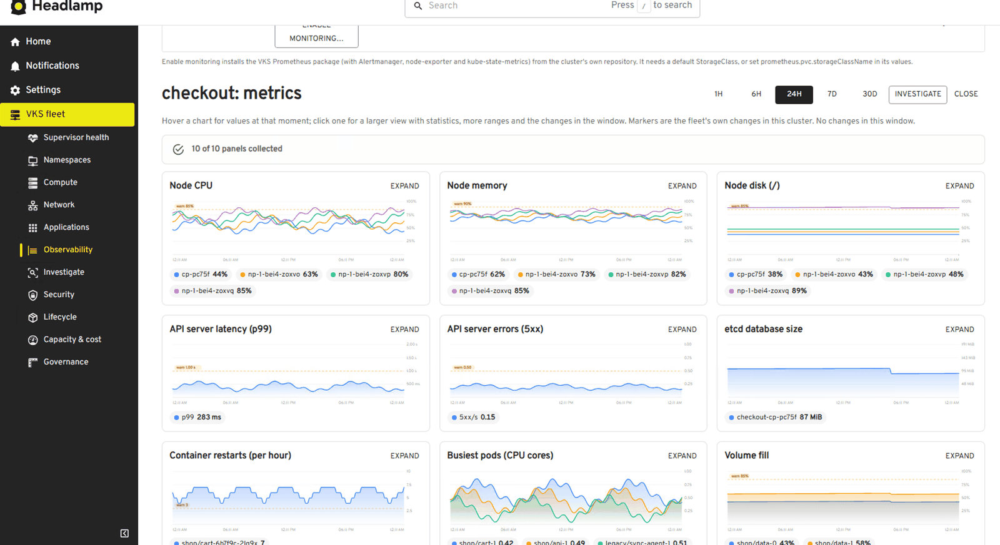

# Observability and investigation

[← Back to the README](../README.md)

## Observability

**Observability** (sidebar) reads each cluster's own **Prometheus** and **Alertmanager** through the Kubernetes API's service proxy: the same connection and permissions as the rest of the plugin, with no extra endpoints, credentials or Grafana needed. VCF Operations isn't required.

- **Finding the stack:** the VKS Prometheus package (`prometheus-server`, `alertmanager` in `tanzu-system-monitoring`), kube-prometheus-stack, or a plain `prometheus` service. node-exporter and kube-state-metrics are detected too.
- **Enable monitoring…** on clusters without Prometheus installs the VKS Prometheus package from the cluster's own repository, through the package install flow: values form, dry run. It needs a default StorageClass (or `prometheus.pvc.storageClassName` in its values).
- **Fleet overview:**
  - clusters monitored, alerts firing, things running out within 7 days, the slowest API server
  - per cluster: node CPU and memory peaks, API p99 latency and 5xx rate, container restarts in the last hour, alert count
- **The page is ordered for operators:** the clusters first, the selected cluster's charts and right-sizing right below, then the app comparison and upgrade safety, alerts, and **Running out** last as a collapsible section.
- **Charts** use smooth curves with soft fills. Hovering shows a crosshair and every series' value at that moment; thresholds are labelled; the fleet's changes appear as markers that explain themselves on hover. **Expand** (or clicking a chart) opens a larger view: ranges from 1 hour to 30 days, per-series statistics (min, average, p95, max, latest, with those over the warning level marked), the changes in that window, **what the panel means** for an operator, and the PromQL behind it.
- **Per-cluster panels** (1 h to 30 d): node CPU, memory and disk; API server latency and errors; etcd database size; container restarts; busiest pods; volume fill; network errors. A panel without data says what would collect it ("needs kube-state-metrics"), and alternative metric names are tried where exporters differ.
- **Changes drawn on every chart:** the fleet's own changes in that cluster (node replacements, upgrades, conditions, the plugin's actions) appear as dashed markers, labelled on hover. A spike and its likely cause show up side by side.
- **Forecasts instead of thresholds:** from the last six hours' trend, *when* a volume, a node's disk, etcd or a node's memory runs out, for example "streaming/data-kafka-1 runs out in about 3 days". A node's memory is forecast only when it has been falling over the last 24 hours as well (free memory rises and falls all day), and the later of the two estimates is shown. Under 7 days is a warning issue; under 2 days is critical.
- **Alerts:** Alertmanager's active alerts (not silenced or inhibited; Watchdog left out) become issues on the fleet page, grouped by alert name, with severity from their labels.

**Compare** (on the same page):

- **Unusual for this time:** each cluster's headline numbers (node CPU and memory, API latency and errors) are compared with the same time a week earlier. A real jump (1.5× and a minimum difference) gets an "unusual for this time" badge, so normal daily peaks don't.
- **Upgrade safety: deprecated APIs in use.** The API server counts requests to deprecated APIs, with the release that removes each one. The page lists them per cluster against the newest release on the Supervisor, and the **Upgrade Planner** warns when a cluster's target would remove an API still in use. It's real traffic, not a manifest scan; the count covers calls since the API server last started.
- **Right-sizing** (in each cluster's detail): what workloads ask for against what they use (95th percentile over the last week), with requests suggested at p95 plus 30%. Workloads asking for far more than they use, and those using more than they ask, are flagged. With a single worker pool, it also works out how many nodes the right-sized requests need, and **what that frees in the namespace, including memory overcommit before and after**. Short history is flagged ("only 20 hours so far").
- **The same app across clusters:** workloads with the same name and image in several clusters, compared on CPU and memory per replica and restarts, with differences called out ("checkout uses 2.7× the CPU per replica", "Restarts only in checkout", "Different versions"). It queries every cluster, so it runs when you ask.

**Exporters without a server.** On VKS the managed Prometheus add-on may run only node-exporter and kube-state-metrics, with no server to store or query them. The page says so, and **Add a Prometheus server…** gives the commands that add one (with Alertmanager) in its own namespace, scraping the existing exporters without touching the managed add-on.

Queries are cached for a minute per cluster, the panels only load for the cluster you open, and the summary refreshes every 5 minutes. They also go through the request limiter, like everything else. Querying through the proxy needs the `services/proxy` permission in the monitoring namespace: operators normally have it; tenants may not.

**When a panel is empty,** it says why and how to fix it (node-exporter, kube-state-metrics, the API server or the kubelets not being scraped), and a coverage line above the charts lists what isn't collected. etcd's database size comes from etcd's own metrics when Prometheus can reach them, and otherwise from the API server, which reports it too (Kubernetes 1.28 and later). Node charts show one series per node, by its short name, even when Prometheus scrapes a node twice.

## Investigate

**Investigate** (sidebar, **Investigate** on any cluster issue, or from a cluster's charts) is one page for one cluster and one window (6 hours, 24 hours or 3 days), with two halves:

**What happened**, on the left: the fleet's own changes and conditions, Alertmanager alerts with their start times, warning events, unusual metrics, forecasts and the open issues, as one story. A short summary names the first symptom and, **if a change came within two hours before it, suggests it as a possible trigger**, stated as a suggestion; when nothing preceded it, it says so. **Copy as post-mortem draft** (or Download .md) gives a Markdown draft with summary, impact, a timeline table, the likely trigger, actions and follow-ups; the parts only people can fill in are marked, and a notice asks for review before sharing.

**The layers under a node**, on the right: the node as the cluster sees it, its Machine, its VM (power, class, zone), the ESXi host it runs on (from VM Operator's `status.host`), the namespace's memory overcommit and the Supervisor's health, each marked healthy, warning or unhealthy. **The deepest unhealthy layer is named as the likely one**: a problem low in the stack usually explains everything above it. Nodes with problems are marked in the picker and preselected; node names in the timeline can be walked down from; and when **most problem nodes are VMs on the same host**, that's called out first.
